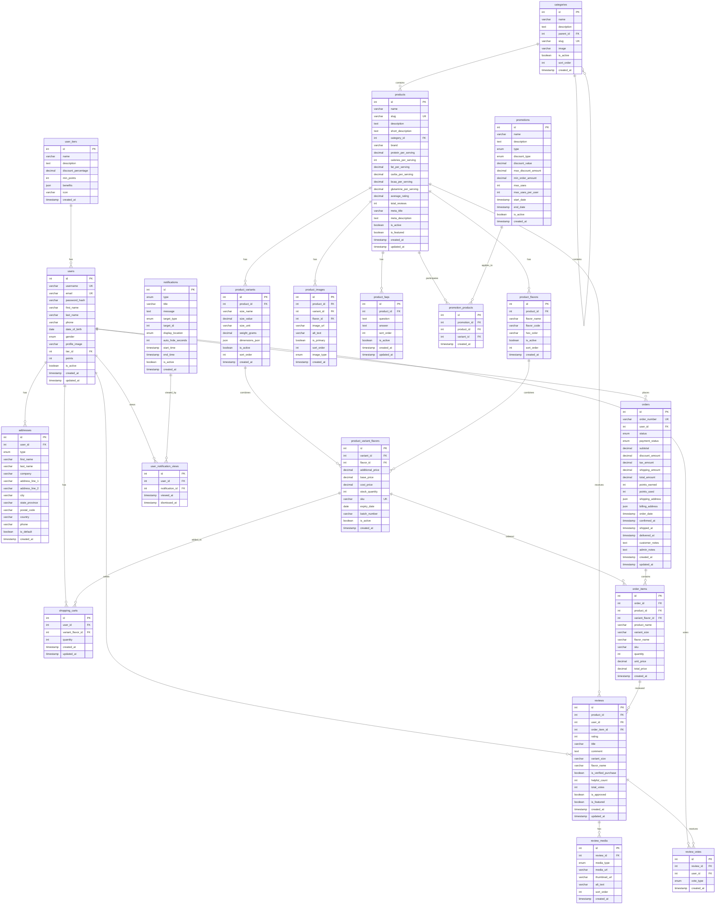

## FITWHEY E-commerce

**ลิ้งค์เข้าสู่เว็บไซต์** https://peerawet.github.io/Dev.Fame.9-9-2025/product-detail-ion.html

### แผนผัง ERD (Mermaid)



# Project Schema Overview

ผมให้ AI Generate schema ออกมา จาก ER Diagram จะมี table และ relation ต่างๆ มากมาย  
แต่ table ที่สำคัญที่สุดสำหรับ scope งานของ project นี้คือ **table `products`**

## อธิบายโครงสร้าง

1. **Product แต่ละตัว** จะอยู่ใน **Category** ต่างๆ เพื่อจัดเป็นหมวดหมู่
2. **1 Product** มีได้หลาย **Promotions** และ **1 Promotion** มีได้หลาย **Products**
3. แต่ละ **Product** จะมีหลาย **Images**, **FAQs**, **Reviews** , **Variants (ขนาด)**, **Flavors (รสชาติ)**

## Variants และ Flavors

ที่สำคัญเลยก็คือ **Variants (ขนาด)**, **Flavors (รสชาติ)**  
ซึ่งจะมีตารางที่ประกอบ 2 attribute นี้เข้าด้วยกัน  
เรียกว่า **`product_variant_flavor`** ซึ่งจะเรียกว่า **1 SKU** และเป็น **Unique Key**

## ความสำคัญของ SKU

- **ตะกร้าสินค้า (Shopping Cart)**  
  เราไม่ได้ Add Product เข้าตะกร้าสินค้า แต่เรา Add **SKU** เข้าตะกร้าสินค้า และระบุจำนวนชิ้น

- **Order**  
  แต่ละ Order ไม่ได้มีลิสต์ Products โดยตรง  
  แต่จะเป็นรายการ **SKU หลายๆ รายการ** ที่ประกอบกันเป็น 1 Order  
  ซึ่งอยู่ใน **ตาราง `order_items`**

- **Inventory**  
  การนับ Stock จะนับตามจำนวนชิ้นของแต่ละ **SKU**

---

## 🚀 การออกแบบ API Design

### 📖 API Documentation

**SwaggerHub:** https://app.swaggerhub.com/apis/test-52b-d60/fitwhey/1

### หลักการออกแบบ API สำหรับ Product Page

การออกแบบ API นี้มุ่งเน้นให้การทำงานของหน้าเว็บมีประสิทธิภาพและลดการโหลดข้อมูลที่ไม่จำเป็น โดยแบ่งการทำงานเป็น 2 ขั้นตอนหลัก:

### 🔄 Workflow การทำงาน

#### **ขั้นตอนที่ 1: โหลดหน้า Product**

```
เมื่อผู้ใช้เข้าสู่หน้า Product (เช่น /products/123)
↓
เรียก API: GET /v1/products/{productId}
↓
แสดงข้อมูลพื้นฐานของสินค้า (รูปภาพ, รายละเอียด, FAQ)
```

#### **ขั้นตอนที่ 2: Add to Cart**

```
เมื่อผู้ใช้เลือก size/flavor และกด "Add to Cart"
↓
เรียก API: GET /v1/products/{productId}/sku
↓
ตรวจสอบ inventory และราคาล่าสุด
↓
ดำเนินการ Add to Cart
```

### 📋 API Endpoints และการใช้งาน

#### **1. GET /v1/products/{productId}**

**วัตถุประสงค์:** โหลดข้อมูลพื้นฐานของสินค้าเมื่อเข้าสู่หน้า Product

**ข้อมูลที่ได้:**

- ✅ ข้อมูลสินค้าพื้นฐาน (ชื่อ, คำอธิบาย, แบรนด์)
- ✅ ข้อมูลโภชนาการ (โปรตีน, แคลอรี่, BCAA)
- ✅ รูปภาพสินค้า (หลัก, แกลเลอรี่, supplement facts)
- ✅ คำถามที่พบบ่อย (FAQs)

**เหตุผลของการออกแบบ:**

- โหลดเร็ว: ข้อมูลที่จำเป็นสำหรับการแสดงผลเบื้องต้น
- ไม่รวม SKU/inventory: เพราะยังไม่จำเป็นในขั้นตอนนี้
- ลดขนาดข้อมูล: ไม่โหลดข้อมูลที่ซับซ้อนโดยไม่จำเป็น
- สามารถ cache ข้อมูลส่วนนี้ได้ เพราะไม่ค่อยเปลี่ยนแปลงบ่อย

#### **2. GET /v1/products/{productId}/sku**

**วัตถุประสงค์:** ตรวจสอบ inventory และราคาก่อน Add to Cart

**ข้อมูลที่ได้:**

- ✅ รายการ variants (ขนาดต่างๆ)
- ✅ รายการ flavors (รสชาติต่างๆ)
- ✅ ข้อมูล SKU แต่ละตัว (ราคา, stock, availability)
- ✅ สถานะ inventory แบบ real-time

**เหตุผลของการออกแบบ:**

- **Real-time accuracy:** ข้อมูล stock และราคาล่าสุด
- **เรียกเมื่อจำเป็น:** ลดการโหลดข้อมูลที่ไม่ใช้
- **Prevent overselling:** ตรวจสอบ stock ก่อน Add to Cart
- **Dynamic pricing:** รองรับการเปลี่ยนราคาแบบ real-time

#### **3. GET /v1/user**

**วัตถุประสงค์:** ดึงข้อมูลผู้ใช้และ tier ปัจจุบัน

**Authentication Behavior:**

- ✅ **มี JWT Token ที่ valid:** แสดงข้อมูล user พร้อม tier ของเขา
- ✅ **ไม่มี JWT Token หรือ Token invalid:** แสดง "Guest" user พร้อม tier เริ่มต้น
- ✅ **JWT Token หมดอายุ:** แสดง "Guest" user

**ข้อมูลที่ได้:**

- ✅ ข้อมูลผู้ใช้ (id, username, email, profile_image, points)
- ✅ สถานะการ authentication (is_authenticated)
- ✅ ข้อมูล tier (ชื่อ, ส่วนลด, สิทธิพิเศษ)


