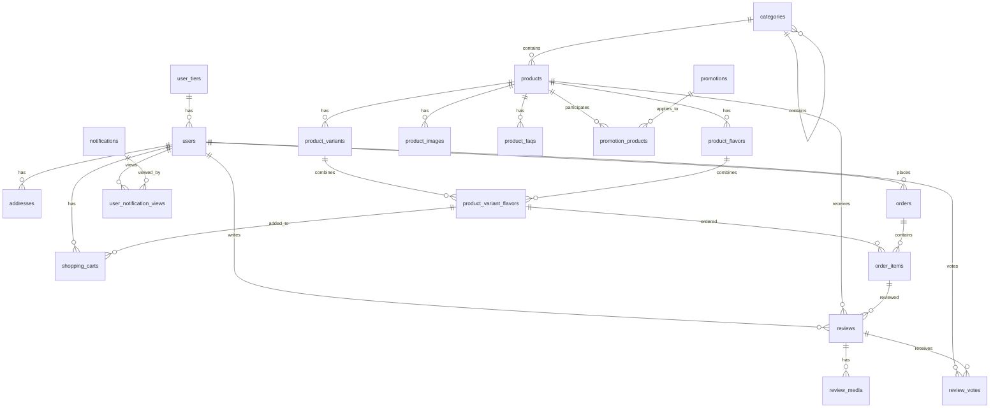

## FITWHEY E-commerce – คำอธิบาย ERD (ภาษาไทย)

คำอธิบายโครงสร้างฐานข้อมูล (ERD) สำหรับระบบ E-commerce ของ FITWHEY ที่รองรับสินค้าแบบมีรูปแบบ (Variant) และรสชาติ (Flavor), ตะกร้า/สั่งซื้อ, รีวิว, โปรโมชั่น และการแจ้งเตือน พร้อมแผนภาพ Mermaid สำหรับเอกสาร

### แผนผัง ERD (Mermaid)

### โครงสร้างหลักของระบบ (7 ส่วน)

- **ระบบจัดการผู้ใช้ (User Management)**: ระดับสมาชิก, ผู้ใช้, ที่อยู่
- **ระบบจัดการสินค้า (Product Catalog)**: หมวดหมู่, สินค้า, รูปแบบ, รสชาติ, รูปภาพ, FAQ
- **ตะกร้าสินค้า (Shopping Cart)**
- **คำสั่งซื้อ (Order Management)**: คำสั่งซื้อ, รายการสินค้า
- **รีวิวสินค้า (Review System)**: รีวิว, รูป/วิดีโอในรีวิว, การโหวตรีวิว
- **โปรโมชั่น (Promotion System)**: โปรโมชั่น, ผูกสินค้าเข้าร่วมโปร
- **การแจ้งเตือน (Notification System)**: แจ้งเตือน, การดู/ปิดแจ้งเตือนของผู้ใช้

### 1) ระบบจัดการผู้ใช้ (User Management)

- **user_tiers (ระดับสมาชิก)**: ระดับ Regular/Pro/VIP, ส่วนลด/สิทธิประโยชน์, คะแนนขั้นต่ำ `min_points`
- **users (ผู้ใช้)**: บัญชี/โปรไฟล์, คะแนนสะสม `points`, สถานะใช้งาน, ผูก `user_tiers`
- **addresses (ที่อยู่)**: หลายที่อยู่ต่อผู้ใช้ (shipping/billing/both), ระบุ `is_default`
- **ความสัมพันธ์**: user_tiers → users (1:N), users → addresses (1:N)

### 2) ระบบจัดการสินค้า (Product Catalog)

- **categories**: โครงสร้างแบบต้นไม้ผ่าน `parent_id` (self-referencing)
- **products**: ข้อมูลพื้นฐาน/โภชนาการ, `average_rating`/`total_reviews`
- **product_variants**: ขนาด Sample/250g/1lb/… ราคา/สต็อกแยกกัน
- **product_flavors**: รสชาติ Chocolate/Vanilla/… พร้อม `hex_color`
- **product_variant_flavors**: SKU จริง (รวม Variant+Flavor), `sku`, `stock_quantity`, `expiry_date`
- **product_images / product_faqs**: รูปภาพ/คำถามที่พบบ่อย
- **ความสัมพันธ์**: categories → categories (1:N), categories → products (1:N), products → variants/flavors (1:N), variants+flavors → variant_flavors (N:M via table)

### 3) ตะกร้าสินค้า (Shopping Cart)

- **shopping_carts**: เก็บรายการ SKU (`variant_flavor_id`) ที่ผู้ใช้เพิ่มและ `quantity`
- **ความสัมพันธ์**: users → shopping_carts (1:N), product_variant_flavors → shopping_carts (1:N)

### 4) คำสั่งซื้อ (Order Management)

- **orders**: `order_number`, `status`/`payment_status`, snapshot ที่อยู่ (`shipping_address`/`billing_address` JSON)
- **order_items**: snapshot ชื่อ/ขนาด/รสชาติ/ราคา ณ เวลาซื้อ
- **ความสัมพันธ์**: users → orders (1:N), orders → order_items (1:N), product_variant_flavors → order_items (1:N)

### 5) รีวิวสินค้า (Review System)

- **reviews**: คะแนน 1–5, ความเห็น, `is_verified_purchase`, อนุมัติ `is_approved`
- **review_media / review_votes**: สื่อแนบรีวิว, โหวตช่วยได้/ไม่ได้
- **ความสัมพันธ์**: products → reviews (1:N), users → reviews (1:N), reviews → review_media (1:N), reviews → review_votes (1:N)

### 6) โปรโมชั่น (Promotion System)

- **promotions**: ประเภทโปร (flash_sale/discount/…)
- **promotion_products**: ผูกโปรกับสินค้า/variant เฉพาะ
- **ความสัมพันธ์**: promotions → promotion_products (1:N), products → promotion_products (1:N)

### 7) การแจ้งเตือน (Notification System)

- **notifications**: ข้อความ, กลุ่มเป้าหมาย, วิธีแสดงผล, เวลาเริ่ม/สิ้นสุด
- **user_notification_views**: ผู้ใช้ดู/ปิดแจ้งเตือนเมื่อใด
- **ความสัมพันธ์**: notifications → user_notification_views (1:N), users → user_notification_views (1:N)

### การทำงานร่วมกันของระบบ (Flow ย่อ)

- ผู้ใช้เลือกสินค้า → เลือก Variant (ขนาด) → เลือก Flavor (รสชาติ)
- เพิ่ม SKU (`product_variant_flavors`) ลงตะกร้า (`shopping_carts`) → ชำระเงิน → สร้าง `orders` และ `order_items`
- ได้รับสินค้าแล้วสามารถเขียน `reviews`
- สต็อกลดระดับ SKU, ติดตามวันหมดอายุ/ล็อตผลิต
- ราคา = ราคาพื้นฐาน Variant + ราคาเพิ่ม Flavor − ส่วนลด Tier − โปรโมชั่น
- คะแนน: ได้/ใช้คะแนน และมีผลต่อระดับสมาชิก

### หมายเหตุการออกแบบ (Highlights)

- โครงสร้างยืดหยุ่น รองรับหลายขนาด/รสชาติ และหมวดหมู่แบบ hierarchy
- ความถูกต้องของข้อมูล: Foreign Keys + snapshot ตอนสั่งซื้อ
- ประสิทธิภาพ: ดัชนีสำคัญสำหรับค้นหา/รายงาน
- ใช้ JSON fields เฉพาะจุดที่ต้องการความยืดหยุ่น (เช่น ที่อยู่ในออร์เดอร์)
- แยกความรับผิดชอบของตารางชัดเจน รองรับการขยายตัวในอนาคต
